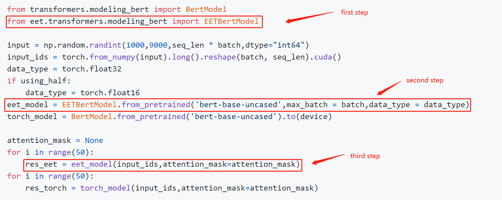
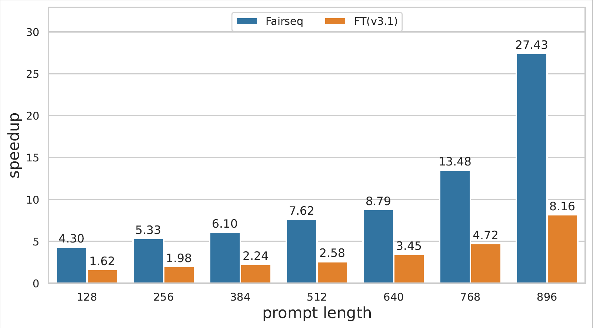
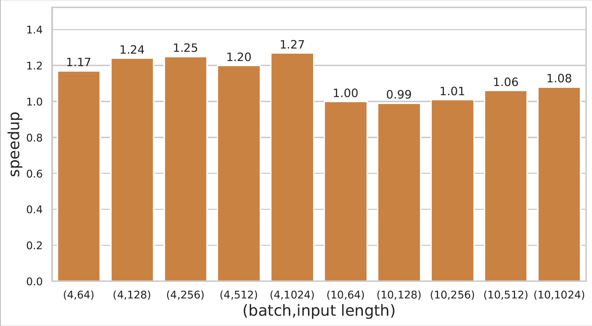

## Easy and Efficient Transformer 
<div align='right' ><font size="1"><b><a href="./README_zh.md">中文README</a></b> </font></div>


<div  align="center"> </div>
</br>

<p align="center">
    <a href="https://github.com/NetEase-FuXi/EET/blob/main/LICENSE">
        
    </a>
    <a href="https://github.com/NetEase-FuXi/EET/tree/main/example/python">
        
    </a>
    <a href="https://github.com/NetEase-FuXi/EET/releases">
        
    </a>
</p>

EET(Easy and Efficient Transformer) is a friendly Pytorch inference plugin focus on Transformer-based models to make mega-size model affordable.

## Features

- Support Mega-size model with single GPU. EET could make an 11B model available online within 24G Ampere GPU.
- Expertise in inference for multi-modal and NLP tasks (CLIP/GPT-3/Bert/Seq2seq etc.).
- High performance. Make the transformer-based model faster and faster with the effect of CUDA kernel optimization and quantization/sparsity algorithm. 
- Out-of-the-box for Transformers and Fairseq. Save your pain of trivial configuration and make your model work within a few lines.
----

* [Model Matirx](#model-matrix)
* [Quick Start](#quick-start)
  * [Environment](#environment)
  * [Installation](#installation)
    * [From Source](#from-source)
    * [From Docker](#from-docker)
  * [Run](#run)
    * [operators APIs](#operators-apis)
    * [Model APIs](#model-apis)
    * [Application APIs](#application-apis)
* [Performance](#performance)
* [Cite Us](#cite-us)
* [Contact us](#contact-us)


## Model Matrix

<table>
        <th bgcolor="#a9a9a9" style="text-align: center"><font color="#00008b">model type</font></th>
        <th bgcolor="#a9a9a9"><font color="#00008b">Transformers</font></th>
        <th bgcolor="#a9a9a9"><font color="#00008b">Fairseq</font></th>
        <th bgcolor="#a9a9a9"><font color="#00008b">Quantization</font></th>
        <th bgcolor="#a9a9a9"><font color="#00008b">SpeedUp</font></th>
        <th bgcolor="#a9a9a9"><font color="#00008b">Since version</font></th>
    </tr>
    <tr>
        <td style="text-align: center"><font color="#1e90ff">GPT-3</font></td><td style="text-align: center">&#x2705;</td><td style="text-align: center">&#x2705;</td><td style="text-align: center">&#x2705;</td><td style="text-align: center"><font color="#dc143c">2~8x</font></td><td style="text-align: center"><font color="#deb887">0.0.1 beta</font></td>
    </tr>
    <tr>
       <td style="text-align: center"><font color="#1e90ff">Bert</font></td><td style="text-align: center">&#x2705;</td><td style="text-align: center">&#x2705;</td><td style="text-align: center">X</td><td style="text-align: center"><font color="#dc143c">1~5x</font></td><td style="text-align: center"><font color="#deb887">0.0.1 beta</font></td> 
    </tr>
    <tr>
       <td style="text-align: center"><font color="#1e90ff">ALBert</font></td><td style="text-align: center">&#x2705;</td><td style="text-align: center">&#x2705;</td><td style="text-align: center">X</td><td style="text-align: center"><font color="#dc143c">1~5x</font></td><td style="text-align: center"><font color="#deb887">0.0.1 beta</font></td> 
    </tr>
    <tr>
       <td style="text-align: center"><font color="#1e90ff">Roberta</font></td><td style="text-align: center">&#x2705;</td><td style="text-align: center">X</td><td style="text-align: center">X</td><td style="text-align: center"><font color="#dc143c">1~5x</font></td><td style="text-align: center"><font color="#deb887">0.0.1 beta</font></td>
    </tr>
    <tr>
       <td style="text-align: center"><font color="#1e90ff">T5</font></td><td style="text-align: center">&#x2705;</td><td style="text-align: center">X</td><td style="text-align: center">X</td><td style="text-align: center"><font color="#dc143c">4~8x</font></td><td style="text-align: center"><font color="#deb887">1.0</font></td>
    </tr>
     <tr>
       <td style="text-align: center"><font color="#1e90ff">ViT</font></td><td style="text-align: center">&#x2705;</td><td style="text-align: center">X</td><td style="text-align: center">X</td><td style="text-align: center"><font color="#dc143c">1~5x</font></td><td style="text-align: center"><font color="#deb887">1.0</font></td> 
    </tr>
    <tr>
       <td style="text-align: center"><font color="#1e90ff">CLIP(GPT+ViT)</font></td><td style="text-align: center">&#x2705;</td><td style="text-align: center">X</td><td style="text-align: center">X</td><td style="text-align: center"><font color="#dc143c">2~4x</font></td><td style="text-align: center"><font color="#deb887">1.0</font></td> 
    </tr>
    <tr>
       <td style="text-align: center"><font color="#1e90ff">Distillbert</font></td><td style="text-align: center">&#x2705;</td><td style="text-align: center">X</td><td style="text-align: center">X</td><td style="text-align: center"><font color="#dc143c">1~2x</font></td><td style="text-align: center"><font color="#deb887">1.0</font></td> 
    </tr>
</table>


## Quick Start

### Environment

* cuda:>=10.1 
* python:>=3.7 
* gcc:>= 7.4.0 
* torch:>=1.5.0 
* numpy:>=1.19.1 
* fairseq
* transformers

The above environment is the minimum configuration, and it is best to use a newer version.

### Installation

Recommend using docker images.

#### From Source
If you are installing from source, you will need install the necessary [environment](#environment).Then proceed as follows: 

```bash
$ git clone https://github.com/NetEase-FuXi/EET.git
$ pip install .
```
Recommend using nvcr.io/nvidia/pytorch:21.12-py3 and other series of images, you can also use the provided Dockerfile file.

#### From Docker

```bash
$ git clone https://github.com/NetEase-FuXi/EET.git
$ docker build -t eet_docker:0.1 .
$ nvidia-docker run -it --net=host -v /your/project/directory/:/root/workspace  eet_docker:0.1 bash
```
The EET and its required environment have been installed in docker.

### Run

We provide three types of APIs:
- **Operators APIs**, such as embedding, masked-multi-head-attention, ffn etc. Enable you to define your custom models.
- **Model APIs**, such as TransformerDecoder, BertEncoder etc. Enable you to integrate EET into your pytorch project.
- **Application APIs**, such as Transformers Pipeline. Enable you to run your model in a few lines.

#### Operators APIs

Operators APIs are the intermediate representation of C++/CUDA and Python. We provide almost all the operators required for Transformer models. You can combine different OPs to build other model structures.
- Operators API table
    |          operators          |       python API       |                  Remarks                  |
    | :-------------------------: | :--------------------: | :---------------------------------------: |
    |    multi_head_attention     |    EETSelfAttention    |              self attention               |
    | masked_multi_head_attention | EETSelfMaskedAttention |             causal attention              |
    | cross_multi_head_attention  |   EETCrossAttention    |              cross attention              |
    |             ffn             |     EETFeedforward     |           feed forward network            |
    |          embedding          |    EETBertEmbedding    | correspondence to Fairseq and Transfomers |
    |          layernorm          |      EETLayerNorm      |           same as nn.LayerNorm            |

- How to use

    The definition of these OPs is in the file [EET/csrc/py11/eet2py.cpp](./csrc/py11/eet2py.cpp) and
    some using examples were show in the files under [python/eet](./python/eet), which tell us how to use those OPs to make up classic models.

#### Model APIs

As an plugin, EET provides friendly model APIs([python/eet](./python/eet)) to integrated into Fairseq and Transformers. 

All you need to do is find the corresponding class according to the tables below (usually with a prefix of 'EET') and initialize an object with the from_torch and from_pretrained function. 

Note: We now only support **pre-padding** for GPT-3.
    
<b>EET and fairseq class comparison table :</b>

|             EET             |             fairseq              |               Remarks               | 
|:---------------------------:|:--------------------------------:|:-----------------------------------:| 
|    EETTransformerDecoder    |        TransformerDecoder        |                                     |
| EETTransformerDecoderLayer  |     TransformerDecoderLayer      |                                     |
|   EETTransformerAttention   |        MultiheadAttention        |                                     |
|  EETTransformerFeedforward  |     TransformerDecoderLayer      | fusion of multiple small operators  |
|   EETTransformerEmbedding   | Embedding + PositionalEmbedding  |                                     |
|   EETTransformerLayerNorm   |           nn.LayerNorm           |                                     |


<b>EET and Transformers class comparison table : </b>

|         EET          |          transformers          |             Remarks             | 
|:--------------------:|:------------------------------:|:-------------------------------:| 
|     EETBertModel     |           BertModel            |                                 |
|   EETBertEmbedding   |         BertEmbeddings         |                                 |
|     EETGPT2Model     |           GPT2Model            |                                 |
|    EETGPT2Decoder    |           GPT2Model            | Transformers has no GPT2Decoder |
| EETGPT2DecoderLayer  |             Block              |                                 |
|   EETGPT2Attention   |           Attention            |                                 |
|  EETGPT2Feedforward  |              MLP               |                                 |
|   EETGPT2Embedding   |          nn.Embedding          |                                 |
|     EETLayerNorm     |          nn.LayerNorm          |                                 |

  In addition to the basic model types above, we have extended some task-specific APIs to support different tasks. The table below is part of our task-specific model APIs :

|                EET                |          transformers          | Remarks | 
|:---------------------------------:|:------------------------------:|:----:| 
|       EETBertForPreTraining       |       BertForPreTraining       |      |
|        EETBertLMHeadModel         |        BertLMHeadModel         |      |
|        EETBertForMaskedLM         |        BertForMaskedLM         |      |
| EETBertForNextSentencePrediction  | BertForNextSentencePrediction  |      |
| EETBertForSequenceClassification  | BertForSequenceClassification  |      |
|     EETBertForMultipleChoice      |     BertForMultipleChoice      |      |
|   EETBertForTokenClassification   |   BertForTokenClassification   |      |
|    EETBertForQuestionAnswering    |    BertForQuestionAnswering    |      |

- How to use

This is a code snip to show how to use model APIs :

<div  align="left"> </div>

You can build your application with the model APIs directly with the task-specific APIs.
There is an example of a fill-mask:

```python
from eet import EETRobertaForMaskedLM
from transformers import RobertaTokenizer
input = ["My <mask> is Sarah and I live in London"]
tokenizer = RobertaTokenizer.from_pretrained('roberta-base')
eet_roberta_model = EETRobertaForMaskedLM.from_pretrained('roberta-base',max_batch = max_batch_size,data_type = data_type)
# first step: tokenize
model_inputs = tokenizer(input,return_tensors = 'pt')
masked_index = torch.nonzero(model_inputs['input_ids'][0] == tokenizer.mask_token_id, as_tuple=False).squeeze(-1)
# second step: predict
prediction_scores = eet_roberta_model(model_inputs['input_ids'].cuda(),attention_mask = model_inputs['attention_mask'])
# third step: argmax
predicted_index = torch.argmax(prediction_scores.logits[0, masked_index]).item()
predicted_token = tokenizer.convert_ids_to_tokens(predicted_index)
```

For more examples, please refer to [example/python/models](example/python/models/).

#### Application APIs

EET provides a ready-made pipelines approach to simplify your application building for different tasks without using the model APIs above.

Here is an example :

```python
import torch
from eet import pipeline
max_batch_size = 1
model_path = 'roberta-base'
data_type = torch.float16
input = ["My <mask> is Sarah and I live in London"]
nlp = pipeline("fill-mask",model = model_path,data_type = data_type,max_batch_size = max_batch_size)
out = nlp(input)
```

Now we support these tasks：

| Task | Since version | 
|-------|-------------|
| text-classification | 1.0 |
| token-classification | 1.0 | 
| question-answering | 1.0 | 
| fill-mask | 1.0 |
| text-generation | 1.0 |
| image-classification | 1.0 |
| zero_shot_image_classification | 1.0 |

For more examples, please refer to [example/python/pipelines](./example/python/pipelines).


## Performance

Detailed performance data of GPT-3 and Bert model inference can be viewed at [link](https://github.com/NetEase-FuXi/EET/blob/main/doc/benchmark.md).
* GPT-3 on A100

<div  align="left"> </div>

* Bert on 2080ti
<div  align="left"> </div>

## Cite Us

If you use EET in your research, please cite the following paper.

```
@misc{https://doi.org/10.48550/arxiv.2104.12470,
  doi = {10.48550/ARXIV.2104.12470},
  url = {https://arxiv.org/abs/2104.12470},
  author = {Li, Gongzheng and Xi, Yadong and Ding, Jingzhen and Wang, Duan and Liu, Bai and Fan, Changjie and Mao, Xiaoxi and Zhao, Zeng},
  keywords = {Computation and Language (cs.CL), FOS: Computer and information sciences, FOS: Computer and information sciences},
  title = {Easy and Efficient Transformer : Scalable Inference Solution For large NLP model},
```

## Video
We have a share on ZhiYuan LIVE, link: https://event.baai.ac.cn/activities/325.

## Contact us
You can post your problem with github issues. 

You can also contact us by email :

ligongzheng@corp.netease.com, dingjingzhen@corp.netease.com ,zhaosida@corp.netease.com

