## Easy and Efficient Transformer

<div align='right' ><font size="1"><b><a href="./README.md">ENGLISH README</a></b> </font></div>


<div  align="center"> </div>
</br>
EET（Easy But Efficient Transformer）是一款针对Transformer-based大模型和长序列场景的高性能pytorch推理插件。

## 功能特性
* Pre-padding解码：Pre-padding保证了上下文和生成序列之间的相对位置不变，和训练阶段了保持一致，进而不用关心推理时候的位置编码问题。基于此策略，EET实现了对上下文的并行推理和对生成序列的增量解码。
* 高性能：设计高度优化的CUDA内核，参考[NVIDIA Faster Transformer](https://github.com/NVIDIA/DeepLearningExamples/tree/master/FasterTransformer/v3.1)，该内核支持长序列以及大型模型。 
* 灵活： 提供算子级和模型级API，允许用户自定义模型或者只更新部分算法逻辑。  
* 易于使用： EET可以直接集成到Fairseq和Transformes中，无需任何代码改动，只需要替换指定文件即可完成从训练到推理的转换。  
* 智能部署：支持动态批处理和可变的输入长度，结合[python web](https://github.com/ShannonAI/service-streamer)可以轻松部署EET。   

EET已经应用于多款网易线上服务，如逆水寒，网易云音乐，Lofter，天谕等。未来EET将致力于万亿模型的线上推理。

* [解码机制](#解码机制)
* [快速开始](#快速开始)
  * [环境](#环境)
  * [安装](#安装)
    * [源码安装](#源码安装)
    * [docker镜像安装](#docker镜像安装)
  * [运行](#运行)
    * [运行BERT\-适配transformers](#运行bert-适配transformers)
    * [运行GPT2\-适配transformers](#运行gpt2-适配transformers)
    * [运行GPT2\-适配Fairseq](#运行gpt2-适配fairseq)
* [支持模型](#支持模型)
  * [BERT](#bert)
  * [GPT2](#gpt2)
* [使用方式](#使用方式)
* [性能](#性能)
* [TODO](#todo)
* [联系我们](#联系我们)

| Frameworks |  maximum model size | maximum sequence length |Performance |Bert|GPT-2|Op-level|Fairseq support|Transformers support|dynamic batch & variable inputs|
|--------------------|-------------|------------------|------------|----|-----|--------|---------------|--------------------|-------------------------------|        
| EET                |16384       | 16384            |highest     | Y  |  Y  |    Y   |       Y       |          Y         |              Y                |
| Faster Transformer |  特定数字的倍数(128,256,384,512)        | 1024             |high        | Y  |  Y  |    N   |       N       |          N         |              N                |
| TensorRT           |  1024        | 1024             |high        | Y  |  N  |    N   |       N       |          N         |              N                | 
| LightSeq           |  1024        | 1024             |high        | Y  |  Y  |    N   |       N       |          N         |              Y                |  
| TurboTransformer   | 1024        | 1024             |medium      | Y  |  Y  |    N   |       N       |          Y         |              Y                | 
| ONNX               | non-limited | non-limited      |slow        | Y  |  Y  |    Y   |       N       |          N         |              Y                |  

## 解码机制
<div  align="left"> 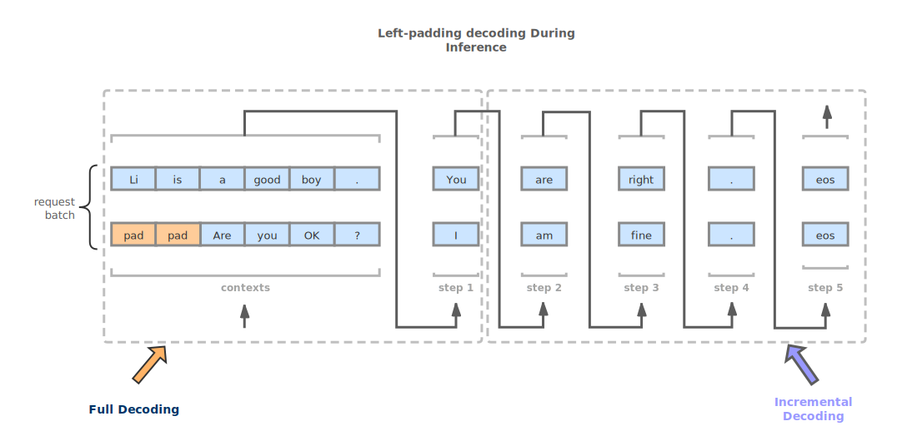</div>


## 快速开始

### 环境

* cuda:>=10.1 
* python:>=3.7 
* gcc:>= 7.4.0 
* torch:>=1.5.0 
* numpy:>=1.19.1 

### 安装
#### 源码安装
如果从源代码安装，则需要安装必要的[environment](#environment)。然后，按以下步骤进行。 
```bash
$ git clone git@github.com:NetEase-FuXi/EET.git
$ pip install transformers==3.5.0
$ pip install fairseq==0.10.0
$ pip install .
```
由于编译了大量的cuda内核，因此安装时间相对较长，请耐心等待。 

#### docker镜像安装

```bash
$ git clone git@github.com:NetEase-FuXi/EET.git
$ cd EET/docker
$ docker build -t your_docker_name:your_docker_version .
$ nvidia-docker run -it --net=host -v /your/project/directory/:/root/workspace  your_Docker_Name:your_docker_version bash
```

此时，EET已安装在docker中。

### 运行
#### 运行BERT-适配transformers
[bert_transformers_example](example/python/bert_transformers_example.py)
```bash
$ cd EET/example  
$ python bert_transformers_example.py
```

#### 运行GPT2-适配transformers
[gpt2_transformers_example](example/python/gpt2_transformers_example.py)
```bash
$ cd EET/example    
$ python gpt2_transformers_example.py
```

#### 运行GPT2-适配Fairseq
[gpt2_fairseq_example](example/python/gpt2_fairseq_example.py)
```bash
$ cd EET/example    
$ python gpt2_fairseq_example.py
```

## 支持模型
目前，我们支持GPT-2, Bert模型。

### BERT
<div  align="left"> 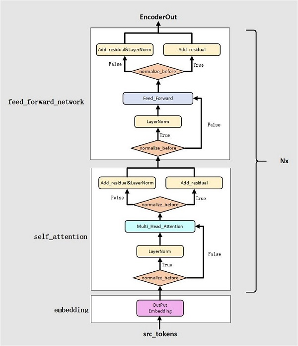</div>

### GPT2
<div  align="left"> 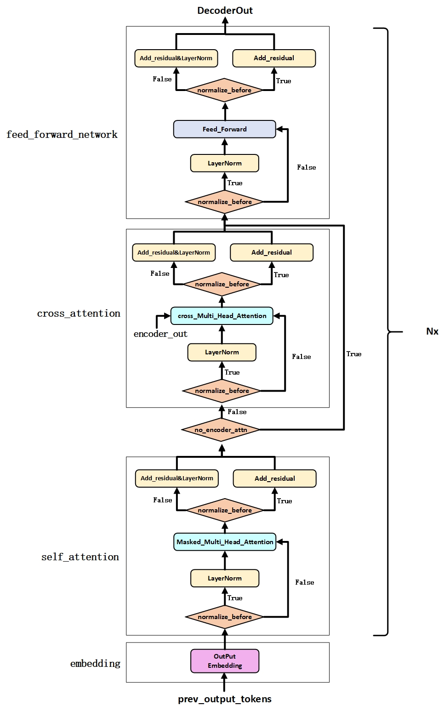</div>

## 使用方式
EET提供了python API接口([python/eet](./python/eet))，用法非常简单，仅三行代码就可以完全适配fairseq和transformers。

* 具体用法   
>1、 如何加载EET模块；如何加载预训练模型；如何做推理  
<div  align="left"> </div>

>2、如何构建model服务   
我们选择[service-streamer](https://github.com/ShannonAI/service-streamer)来创建我们的模型服务。

>3、如何自定义模型结构   
你可以参考下面列出来的API列表，只需要修改[python/eet](./python/eet)下的文件就可以很方便的构建自己的模型结构。

>4、如何将EET插入fairseq和transformers      
如果你想将EET插入fairseq或者transformers里，对照下面给出的类的对照表，替换修改即可。

* API  
    1.模型API：我们提供了现成的GPT2和BERT模型API，因此您可以加载PyTorch模型并仅用几行代码来进行推理，就像使用Fairseq或Transformers一样。  
    <b>EET 和 fairseq 类对照表</b>
    | EET | fairseq| Remarks | 
    |-------|-------------|-------------| 
    | EETTransformerDecoder | TransformerDecoder | No |
    | EETTransformerDecoderLayer | TransformerDecoderLayer | No |
    | EETTransformerAttention | MultiheadAttention | No |
    | EETTransformerFeedforward | TransformerDecoderLayer | fusion of multiple small operators |
    | EETTransformerEmbedding | Embedding + PositionalEmbedding | No |
    | EETTransformerLayerNorm | nn.LayerNorm | No |

    <b>EET和transformers 类对照表</b>
    | EET | transformers| Remarks | 
    |---------------|-----------------|----| 
    | EETBertModel | BertModel | No |
    | EETBertEncoder | BertEncoder | No |
    | EETBertEncoderLayer | BertLayer | No |
    | EETBertAttention | BertAttention | No |
    | EETBertFeedforward | BertIntermediate + BertOutput | No |
    | EETBertEmbedding | BertEmbeddings | No |
    | EETGPT2Model | GPT2Model | No |
    | EETGPT2Decoder | GPT2Model | transformers has no GPT2Decoder |
    | EETGPT2DecoderLayer | Block | No |
    | EETGPT2Attention | Attention | No|
    | EETGPT2Feedforward | MLP | No |
    | EETGPT2Embedding | nn.Embedding | No |
    | EETLayerNorm | nn.LayerNorm | No |

    2.算子API：我们提供了Transformer模型所需的所有算子，例如multiheadattention，layernorm，FFN等，您可以结合不同的算子来构建不同的模型结构。

    | operators APIs | Remarks | 
    |-------|-------------|
    | masked_multi_head_attention | GPT2 self_attention |
    | cross_multi_head_attention | cross_attention | 
    | multi_head_attention | Bert self_attention | 
    | ffn | FeedForwardNetwork |
    | embedding | transformers & fairseq |
    | layernorm | nn.LayerNorm |

## 性能
在不同场景下测试EET的性能数据如下：
Note : 在总时间的测试中，假设了上下文的比例为５０％
* 3090 (batch_size=4, max_sequence_length=1024, context_length=512, precision=half)
  | Model Name | Params | Layers | Hidden_units | inference time of per-token | total time of 1024 tokens |
  | GPT-3 Small| 125M   | 12     | 768          | 3ms                         | 1.67s                     |
  | GPT-3 Medium | 350M | 24     | 1024         | 7ms                         | 3.546s                    |  
  | GPT-3 Large | 760M  | 24     | 1536         | 8ms                         | 4.361s                    |
  | GPT-3 XL   | 1.3B   | 24     | 2048         | 10m                         |  5.091s                   |
  | GPT-3 2.7B | 2.7B   | 32     | 2560         | 60ms                        |  31s                      |
  | GPT-3 5B | 5B       | 45     | 3072         | 25ms                        |  13.149s                  |
  | GPT-3 8B   | 8B     | 40     | 4096         |  30ms                   | 15.97s                        |
  | GPT-3 10B | 10B     | 36     | 5120         | outOfMemory             | outOfMemory                   |

* 3090 (batch_size=16, max_sequence_length=1024, context_length=512, precision=half)
  | Model Name | Params | Layers | Hidden_units | inference time of per-token | total time of 1024 tokens |
  | GPT-3 Small| 125M   | 12     | 768          | 3ms                         | 1.61s                     |
  | GPT-3 Medium | 350M | 24     | 1024         | 6ms                         | 3.416s                    |  
  | GPT-3 Large | 760M  | 24     | 1536         | 8ms                         | 4.402s                    |
  | GPT-3 XL   | 1.3B   | 24     | 2048         | 11m                         |  6.374s                   |
  | GPT-3 2.7B | 2.7B   | 32     | 2560         | 175ms                        |  91s                      |
  | GPT-3 5B | 5B       | 45     | 3072         | 31ms                        |  19.565s                   |
  | GPT-3 8B   | 8B     | 40     | 4096         |  outOfMemory                | outOfMemory                |
  | GPT-3 10B | 10B     | 36     | 5120         | outOfMemory                 | outOfMemory                |

我们在两个GPU硬件平台上测试了EET的性能。并且选择pytorch、NVIDIA Faster Transformers以及lightseq进行比较。 

### GPT-2推理性能

* RTX 2080ti (batch_size=4, hidden_units=1024, sequence_length=1024, precision=fp16)

<div  align="left"> 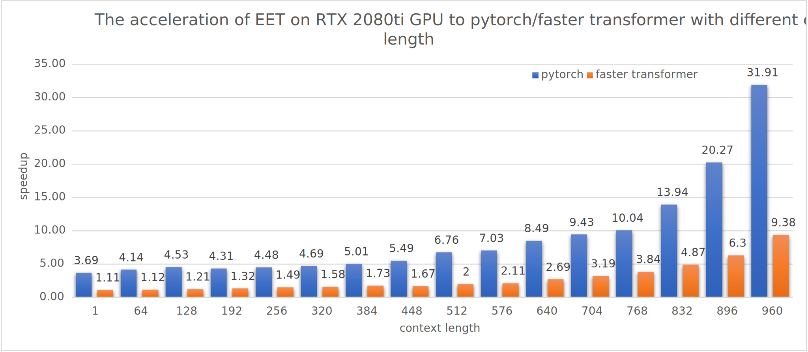</div>

* RTX 2080ti (batch_size=4, context_ratio=50%, sequence_length=1024, precision=fp16)
<div  align="left"> 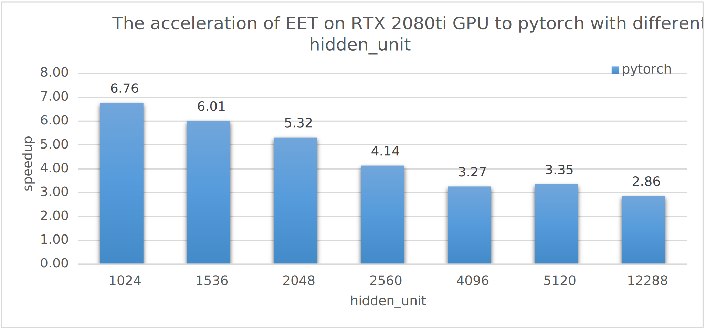</div>

* A100 (batch_size=4, hidden_units=1024, sequence_length=1024, precision=fp16)

<div  align="left"> 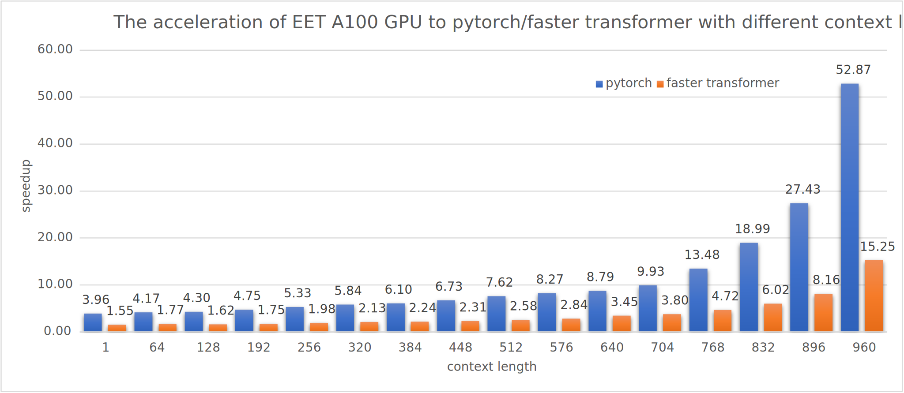</div>

* A100 (batch_size=4, context_ratio=50%, sequence_length=1024, precision=fp16)

<div  align="left"> 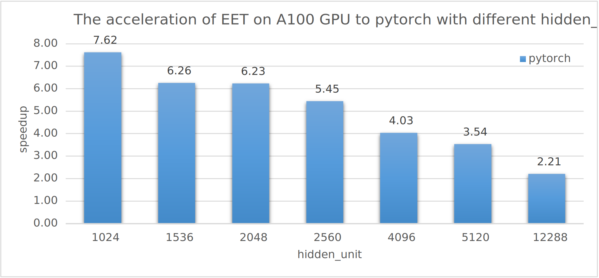</div>

中等规模(hidden_units=1024,max_seq_len=768),compare with lightseq:
<div  align="left"> 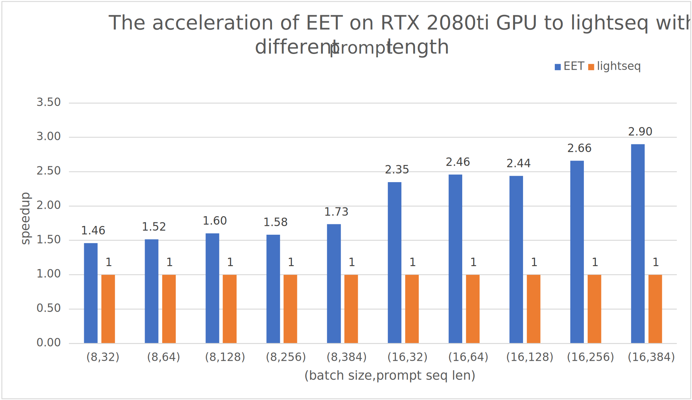</div>

小规模(hidden_units=768,max_seq_len=128),compare with lightseq:
<div  align="left"> 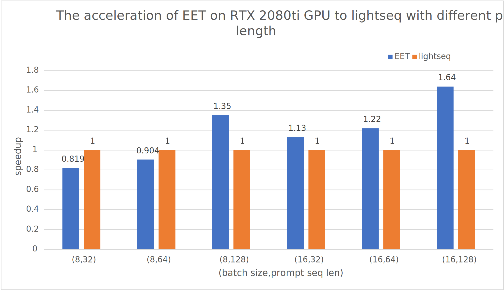</div>


### BERT推理性能

* RTX 2080ti

<div  align="left"> 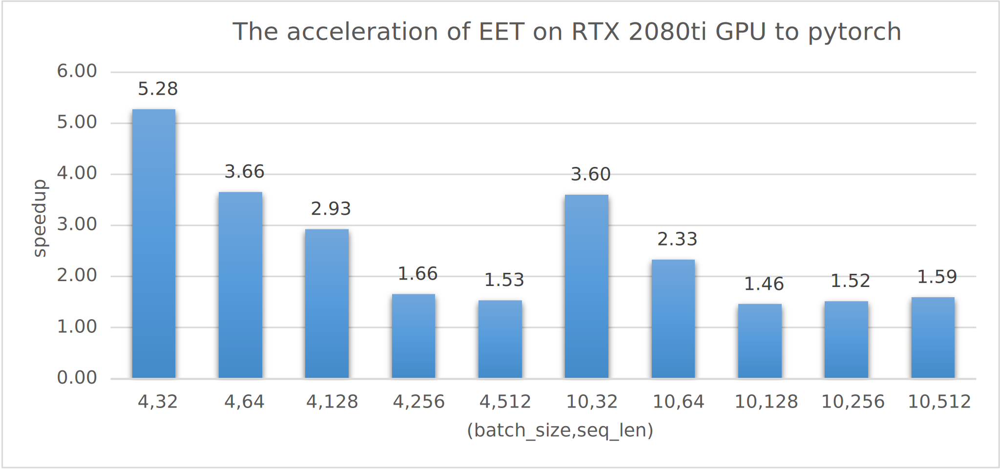</div>

* A100

<div  align="left"> 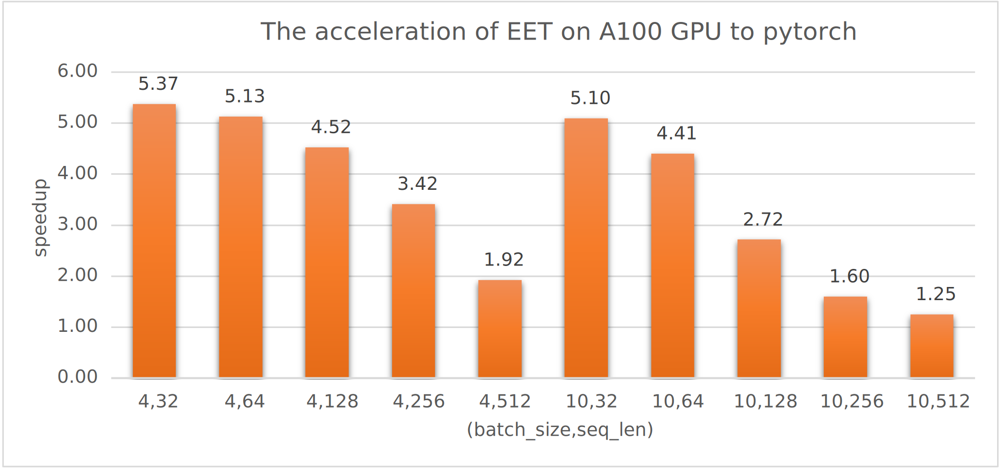</div>

1. int8
2. sparse


## 联系我们
您可以将您的问题发布在github issues。 
