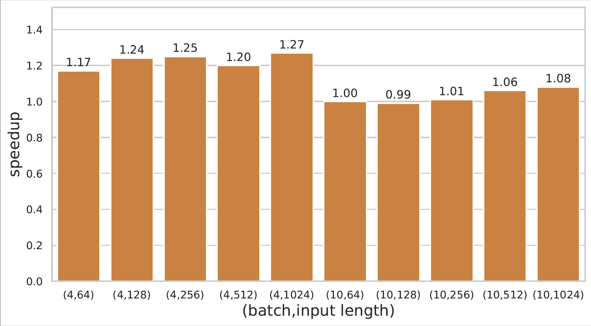

We tested the performance of EET on two GPU hardware platforms. We chose pytorch, NVIDIA Faster Transformers, and lightseq implementations for comparison.

## GPT-3 memory usage and performance
We measure the inference time and memory occupancy in different scenarios. 
Note : Total time are measured with 50% of the context
* A100 (batch_size=4, max_sequence_length=1024, context_length=512, precision=half)
  | Model Name | Params | Layers | Hidden_units | inference time of per-token | total time of 1024 tokens |
  |-------------|-------|--------|--------------|-----------------------------|---------------------------|
  | GPT-3 Small| 125M   | 12     | 768          | 2.69ms                         | 1.38s                  |
  | GPT-3 Medium | 350M | 24     | 1024         | 5.58ms                         | 2.86s                  |  
  | GPT-3 Large | 760M  | 24     | 1536         | 6.64ms                         | 3.41s                  |
  | GPT-3 XL   | 1.3B   | 24     | 2048         | 7.3m                           | 3.76s                  |
  | GPT-3 2.7B | 2.7B   | 32     | 2560         | 46.1ms                         | 23.6s                  |
  | GPT-3 6.7B | 6.7B   | 32     | 4096         | 17.2ms                         | 8.85s                  |
  | GPT-3 13B | 13B     | 40     | 5120         | 29.3ms                         | 15.12s                 |

* A100 (batch_size=16, max_sequence_length=1024, context_length=512, precision=half)
  | Model Name | Params | Layers | Hidden_units | inference time of per-token | total time of 1024 tokens |
  |-------------|-------|--------|--------------|-----------------------------|---------------------------|
  | GPT-3 Small| 125M   | 12     | 768          | 2.84ms                         | 1.46s                     |
  | GPT-3 Medium | 350M | 24     | 1024         | 6ms                         | 3.11s                    |  
  | GPT-3 Large | 760M  | 24     | 1536         | 7.39ms                         | 3.80s                    |
  | GPT-3 XL   | 1.3B   | 24     | 2048         | 8.27m                         |  4.26s                   |
  | GPT-3 2.7B | 2.7B   | 32     | 2560         | 116ms                        |  59.8s                      |
  | GPT-3 6.7B | 6.7B     | 32     | 4096         |  23.18ms                | 12.25s                |
  | GPT-3 13B | 13B     | 40     | 5120         | 43.42ms                 | 22.58s                |
  

## We show GPT2 inference performance here.

* RTX 2080ti

 

* A100

 

* Compare with lightseq:

 

* Compare with fastertransformer:

 

 

## We show BERT inference performance here.

 

