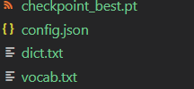

为了方便使用，我们提供了pipeline，用于用户通过几行代码实现不同的任务。

目前我们提供多种任务，包括text-classification、token-classification、question-answering、fill-mask、text-generation、image-classification、zero-shot-image-classification。这些任务都是基于EET已经支持的模型实现的。

## 用法：

### 1、导入模块
```python
import torch
from eet import pipeline
```
### 2、设置

设置最大batch_size和数据类型,默认max_batch_size=1,数据类型为fp32,也可指定模型,例如：model='roberta-base'，默认模型见[pipelines/__init__.py](https://github.com/NetEase-FuXi/EET/blob/main/python/eet/pipelines/__init__.py)，对于文本生成任务还需要增加一个参数full_seq_len，用于表示提示词的最长长度，用于内部分配显存，默认是512。
```python
max_batch_size = 1
model_path = 'roberta-base'
data_type = torch.float16
```
### 3、初始化pipeline

下面已完型填空任务为例
```python
nlp = pipeline("fill-mask",model = model_path,data_type = data_type,max_batch_size = max_batch_size)
```
### 4、开始推理
```python
out = nlp(["My <mask> is Sarah and I live in London"])
```
用法非常简单。

**注意** ：对于text-generation（文本生成）任务，我们既支持transformers模型也支持fairseq模型，对于transformers预训练模型只需要跟上述一样的方式运行即可。

对于fairseq gpt预训练模型，需要准备一下步骤

* 1、需要生成一个config.json和vocab.txt文件

生成方法直接运行example/python/convert下的save_config_from_fairseqmodel.py和save_vocab_from_dict.py即可，注意修改模型路径。

* 2、将生成的文件放在和模型文件同样的路径下。在运行pipeline的时候指定模型文件即可。

最终模型文件所在目录至少应有以下几个文件，注意各个文件名需要和下图一致：

<div  align="left"> </div>
